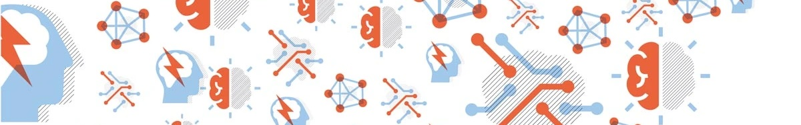

---
# Feel free to add content and custom Front Matter to this file.
# To modify the layout, see https://jekyllrb.com/docs/themes/#overriding-theme-defaults

permalink: /
title: Home
layout: all
---

This 3/4-day tutorial is dedicated to **reproducible research (RR) in transportation**. As transportation researchers, it has been our experience that research in transportation is hard to reproduce. Needless to say, this holds back the scientific progress of the field; every time a student needs to re-implement another paper or collect a similar dataset, that is time that could have been spent on new research. Fortunately, tools and best practices supporting RR are maturing, so it is the perfect time for the ITS community to engage with RR. We hope that this tutorial will help to move the needle on reproducibility in transportation, so that our research collectively achieves greater impact.

This is the first of hopefully many tutorials on RR in transportation; as such, we want your feedback on your RR needs and interests! Please do not hesitate to get in touch.

#### Background

Reproducibility is a cornerstone of scientific research, providing the foundation for validating results and advancing knowledge. In research fields where computation-based scientific publication is pervasive, a credibility crisis has been warned. RR is gaining extensive attention in various fields, such as remote sensing, medicine, and data science, to ensure the validity and reliability of scientific findings.

In the field of traffic and transportation, Intelligent Transportation Systems (ITS) represent the most computationally intensive, fast-growing area of research with significant implications of outcomes for the general population. In ITS, the rapid evolution of technologies and methodologies has emphasized the need for RR practices. Reproducibility can refer to computational reproducibility (the focus of this tutorial), ensuring that the same data and analysis steps produce consistent results. However, when it is infeasible to replicate an entire scientific study, achieving reproducibility sets a minimum standard of scientific rigor by allowing others to validate and build upon the findings. With ITS being inherently interdisciplinary and data-driven, reproducibility forms the backbone for credible, reliable research outputs.

#### The objectives of the tutorial
- An introduction to the fundamental concepts and importance of RR to the domain of ITS 
- Provide hands-on training in the use of tools and software that facilitate reproducibility
- Guide researchers on how to properly document and organize data and project outcomes to foster open science
- Encourage collaboration among tutorial participants and the broader ITS community to foster a community that values and practices reproducible research

#### Topics we will cover

- **Foundations of reproducible research (RR)**: What does it mean for research to be reproducible? Why is it important? Why is it worthwhile to engage in RR? What makes reproducibility hard? Even when provided the exact dataset and code of another research paper?!
- **RR challenges in ITS**: What are challenges of RR in the field of ITS? Are they general across many fields or specific to this one? What are examples of (non-)reproducibility in ITS research?
- **The state of RR in ITS**: Through a live participant survey, we will get a taste of the RR attitudes and needs of the ITS community.
- **Documenting code and data for RR**: What kinds of missing metadata can be responsible for reproducibility failures? How can version control tools like git and github be used for RR? How can project files be organized for readability?
- **Data sharing and management for RR**: What are best practices for storing data? Does the data format matter? How to participate in RR inspite of data with sensitive information?
- **Hands-on activities**: Through two hands-on activities, participants will attempt to create small reproducible projects. Another participant will then try to reproduce it. Will they succeed? The first activity will focus on a simple report. The second activity will use a small project with code and data.

#### Participant requirements
Participants should bring laptops with installed required software to participate in hands-on sessions. Required software installation guides will be provided prior to the workshop (please check back here before the tutorial!).

### Tentative Schedule

<!-- The workshop happened on July 10 in hybrid mode. The in-person location is in Daegu, Republic of Korea.

The [recording of the workshop](https://youtu.be/5VN7T0HujnQ) can be accessed on YouTube. -->

<table>
<thead>
  <tr>
    <th>Time (<a href="https://www.worldtimeserver.com/current_time_in_CA-AB.aspx?city=Edmonton">MDT</a>, UTC-6)</th>
    <th>Event</th>
  </tr>
</thead>
<tbody>
  <tr>
    <td>9:00 am - 9:10 am</td>
    <td>Introductory Remarks</td>
  </tr>
  <tr>
    <td>9:10 am - 10:45 am</td>
    <td><b>Session 1: Introduction to Reproducible Research</b>  Speakers/Contributors: Bidisha Ghosh, Zuduo Zhang</td>
  </tr>
  <tr>
    <td></td>
    <td>Lecture 1:  Introduction to reproducible research (30 mins)</td>
  </tr>
  <tr>
    <td></td>
    <td>Activity 1: Is your research reproducible? (60 min)</td>
  </tr>
  <tr>
    <td></td>
    <td>Follow-up of hands-on activity (15 mins)</td>
  </tr>
  <tr>
    <td>10:45 am - 11:00 am</td>
    <td>Coffee Break</td>
  </tr>
  <tr>
    <td>11:00 am - 13:00 pm</td>
    <td><b>Session 2: Documentation of Data and Code for Reproducibility</b>  Speakers/Contributors: Cathy Wu, Nicholas Saunier </td>
  </tr>
  <tr>
    <td></td>
    <td>Lecture 2: How to badly document a research project (30mins)</td>
  </tr>
  <tr>
    <td></td>
    <td>Activity 2: Can you reproduce my simulation result within 5 minutes? (60 minutes)</td>
  </tr>
  <tr>
    <td></td>
    <td>Q&A and Wrap-Up (15 minutes)</td>
  </tr>
  <tr>
    <td>13:00 pm - 14:00 pm</td>
    <td>Lunch (Optional)   Get involved in the community dedicated to Reproducible Research in Transportation.</td>
  </tr>
  <tr>
    <td>14:00 pm - 15:00 pm</td>
    <td><b>Session 3: Panel discussion on data sharing and management</b>   Speakers/Contributors: Irene Martínez</td>
  </tr>
  <tr>
    <td>15:00 pm - 15:10 pm</td>
    <td>Concluding Remarks</td>
  </tr>
</tbody>
</table>

We are also grateful to Zuduo Zhang, Nicholas Saunier, and the [REROUTE](https://reroute-project.eu/) project funded by Horizon Europe Marie Skłodowska-Curie Actions (MSCA) for their help in organizing the tutorial.
